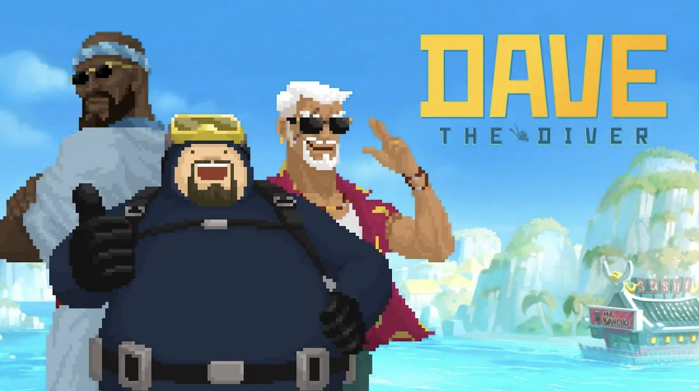

# My Favourite Game 2023

## Dave The Diver
### What is this game and why do I like it?
- Dave the Diver is a 2D indie-looking game about diving, fishing, farming, exploration adn restaurant management game. It combines many mini games
into one well-rounded and well-balanced game. 
- I love this game because, firstly, it has diving and the ocean!! Sushi!! I use a controller to play it and the mechanics are very smooth and satisafying. I love how what I fish in the day will appear in the menu and I get to make the menu and manage the restaurant. There are so many customizability in this game and a whole world of ocean to explore including an underwater ancient civilization! There is just so much things in this which is why I think people keep going back to play it. 
- There is a con I would like to point out. When starting this game, it was very enjoyable, it actually has chapters as you go and finish tasks and events, of course you could ignore them but it will just keep coming back up in a few game days. The more you progress, the game becomes harder and harder exponentially, sometimes it can get frustrating when you can't get past a boss that you have no choice but to face. Then it just puts you in a standstill (for people who wants to enjoy the game instead of going on the more competitive route). 

### Company 
- [MintRocket](https://mintrocketgames.com/en/davethediver) 

### Release date
- October 27, 2022

### Game Engine
- Unity! 

### Image 

### List of similar games
- [Stardew Valley](https://www.stardewvalley.net/) - 2D indie 
- [ABZU](https://abzugame.com/) - Underwater 
- [GRIS](https://www.devolverdigital.com/games/gris) 2D but shifts perspective as you move, animation! 

